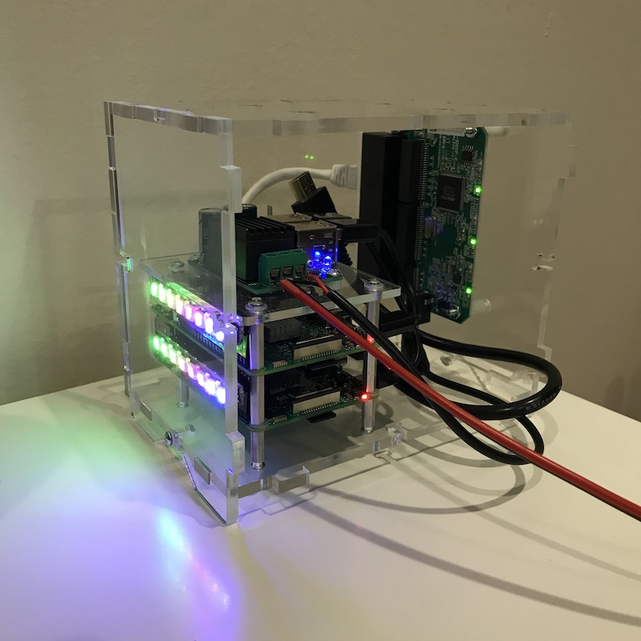

* needed to mess around with apt https://github.com/ansible/ansible-modules-core/issues/2951
* getting wifi happy 

```
touch /Volumes/boot/ssh

cat <<EOF > /Volumes/boot/wpa_supplicant.conf
ctrl_interface=DIR=/var/run/wpa_supplicant GROUP=netdev
update_config=1
country=US

network={
    ssid="Happy55"
    psk=$(cat ~/.wifi_pass)
}
EOF
```

* adding ssh keys - can I do this in ansible when the PIs have password auth

```
ssh pi@redpi  << EOF
  mkdir ~/.ssh
  echo "$(cat ~/.ssh/id_rsa.pub)" >> ~/.ssh/authorized_keys
EOF
```

* running ansible to install:
  * kafka `ansible-playbook -i hosts.yml playbook.yml`
  * pimoroni lights `ansible-playbook lights.yml -i hosts.yml`
* adhoc commands 
  * `ansible broker -a "echo hello" -i hosts.yml`
  * `ansible broker -a "python /home/pi/Pimoroni/blinkt/examples/rgb.py 50 0 0" -i hosts.yml`
* installing pimoroni blinkt `curl https://get.pimoroni.com/blinkt | bash`
  * alternative install with ansible https://hem.fugedi.se/bitbucket/projects/TP/repos/raspberry-cluster/browse/installation/blinkt
* messing around with topics

```
kafka-topics --create \
--zookeeper 10.0.0.120:2181 \
--topic replicated-topic-one \
--partitions 1 \
--replication-factor 2

kafka-topics --describe \
--zookeeper 10.0.0.120:2181 \
--topic replicated-topic-one

kafka-console-producer --broker-list 10.0.0.120:9092 --topic replicated-topic-one

kafka-console-consumer --bootstrap-server 10.0.0.120:9092 --topic replicated-topic-one --from-beginning

kafka-producer-perf-test \
    --topic replicated-topic-one \
    --num-records xxx \
    --record-size xxx \
    --throughput xxx \
    --producer-props bootstrap.servers=10.0.0.120:9092
```


## Grep Ideas

### Leader

[2019-03-29 21:17:41,338] DEBUG [Partition replicated-topic-two-0 broker=101] Recorded replica 102 log end offset (LEO) position 21. (kafka.cluster.Partition)

### Follower

[2019-03-29 21:17:21,825] TRACE [ReplicaFetcher replicaId=102, leaderId=101, fetcherId=0] Follower has replica log end offset 21 after appending 73 bytes of messages for partition replicated-topic-two-0 (kafka.server.ReplicaFetcherThread)



